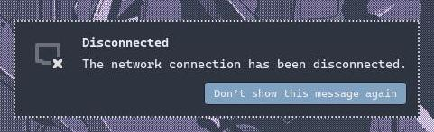
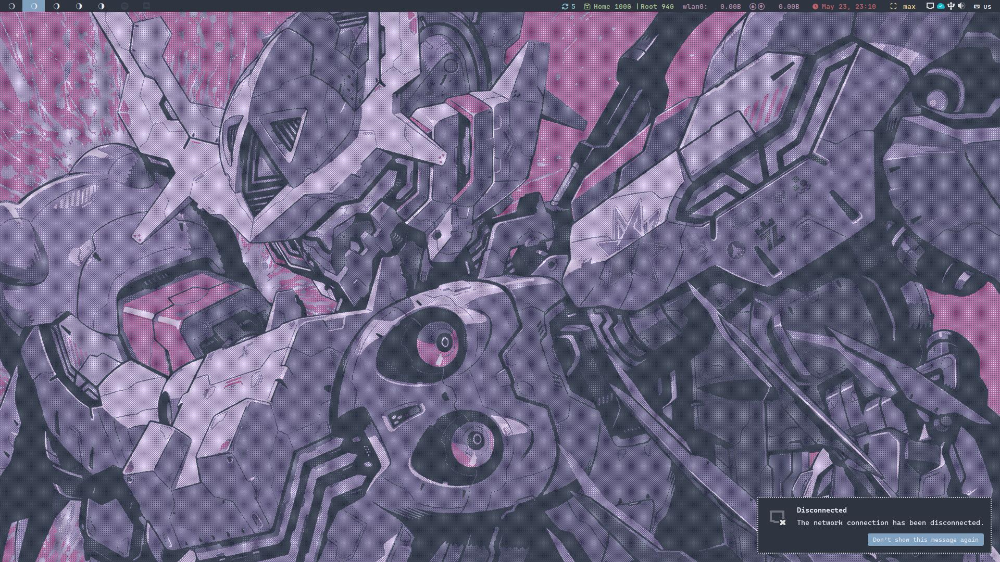
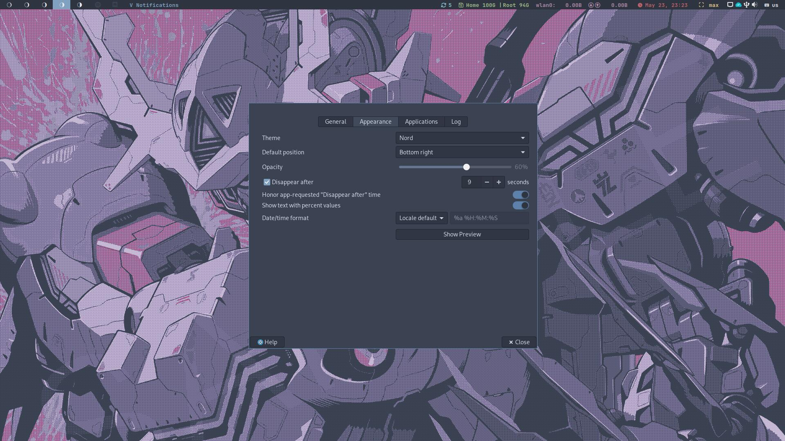

# Xfce Notifyd with Nord theme

### Pre-requisites

- libnotify
- xfce4-notifyd [Link to repo](https://github.com/xfce-mirror/xfce4-notifyd)

If you want to use this notification theme. You have to clone this repo in your
**theme/** folder in my case my theme folder was in ***/usr/share/themes/...***
( I'm using ArchLinux distro ) and then run this command in you terminal
```
xfce4-notifyd-config
```

## Preview notification
* Notification



* Notification on Desktop



* Select theme in xfce4-notifyd-config


